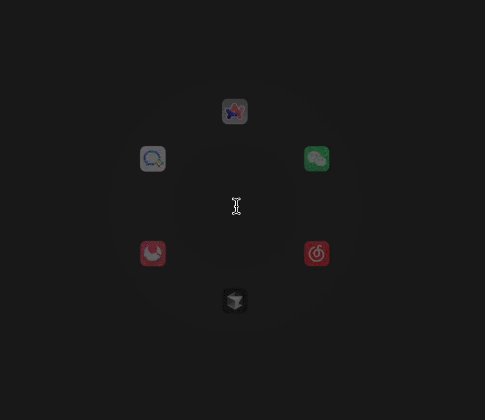

# Kortin does dotfiles
This is my personal repository for unified configuration management and backup of my macOS development environment.

## What's inside
The directory structure represents configurations for various tools:
 - **git**: Git-related configurations and my commonly used aliases
 - **zsh**: Zsh shell configuration files, including plugins, aliases, and custom functions
 - **karabiner**: Karabiner-Elements keyboard customization configuration
 - **hammerspoon**: Hammerspoon automation scripts and configuration
 - **iterm2**: iTerm2 terminal emulator configuration and scripts
 - **sketchybar**: macOS status bar customization configuration
 - **nvim**: Neovim editor configuration
 - **wezterm**: WezTerm terminal emulator configuration
 - **lazygit**: LazyGit terminal Git client configuration
 - **yabai**: Yabai window manager configuration
 - **vscode**: Visual Studio Code editor configuration
 - **tmux**: Tmux terminal multiplexer configuration

### Git
- Uses Delta as diff and merge tool
- Function-style aliases for various git commit types (feat, fix, docs, style, etc.)
- Simplified aliases for common commands (st, c, cm, co, br, etc.)
- Graphical log display (lg, ls commands)
- LazyGit integration (ui command)
- Built-in gitignore template generation (ignore command)
- Configuration suitable for multiple workspaces

### zsh
- Based on Oh My Zsh framework
- Uses wedisagree theme
- Rich plugin collection:
  - git, git-commit: Git support and commit assistant
  - sudo: Double-press Esc to automatically add sudo
  - eza: Modern ls alternative
  - fzf: Fuzzy file finder
  - zsh-autosuggestions: Auto-completion suggestions
  - zsh-syntax-highlighting: Syntax highlighting
  - zoxide: Smart directory jumping (z command)
  - copypath, copyfile: Copy file paths and contents
- Custom aliases and functions
  - Shortcuts for Python, Git, file operations
  - Formatted file listings (ls using eza)
  - Quick editing of common configuration files
  - Automatic actions based on file suffixes

### Sketchybar
Since I'm accustomed to using macOS multiple desktops for development, with different applications open on each desktop, I need to know which desktop I'm currently on and what apps are open. macOS's native system obviously doesn't support this feature.

My core need for Sketchybar is to fill this gap. At the same time, I can customize some real-time system resource monitoring, as well as any features I need.


Sketchybar uses Lua configuration and includes the following main components:
- Desktop space indicators
- System resource monitoring (CPU, memory, battery)
- Display of currently running application icons
- Volume and time display

### Yabai
Yabai is a highly customizable window manager that provides tiling window management functionality for macOS:
- Automatically arranges windows to efficiently utilize screen space
- Quick keyboard navigation to switch between windows and desktops
- Custom window rules and layouts
- Integration with skhd shortcut key daemon

### hammerspoon
Currently there are only two scripts:
- Automatically mutes Mac after connecting to company intranet Wi-Fi
- Double-click Alt to pop up an application ring for quick access to commonly used apps
  

### Karabiner-Elements
Keyboard customization configurations include:
- Modifying key bindings and behaviors
- Custom keyboard mappings for specific applications
- Complex modifier key combinations

### iTerm2 & WezTerm
Configurations for two advanced terminal emulators:
- Color schemes and font settings
- Hotkey window configuration
- Shell integration features
- Window splitting and layout settings

## How to use

### Automatic Configuration
1. `cd` to the current project, grant read, write, and execute permissions to `install.sh`
```shell
chmod +x ./install.sh
```
2. Symlink configuration files to the corresponding system locations
```shell
./install.sh setup
```
3. To update configurations, you can run
```shell
./install.sh backup
```

### Manual Configuration
Simply copy the configuration parts you need to the corresponding configuration files

## License

This project is licensed under the MIT License - see the [LICENSE](LICENSE) file for details.
